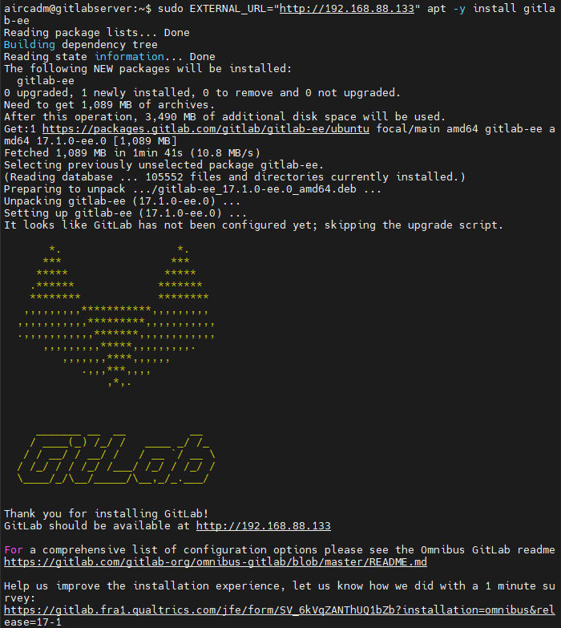
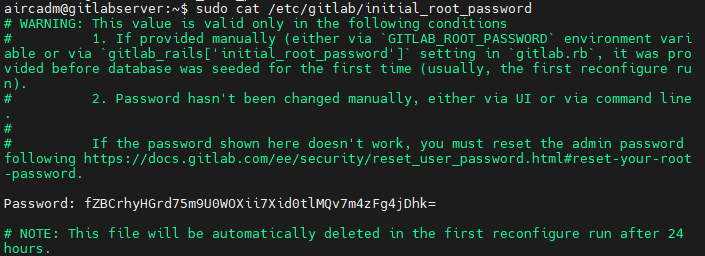
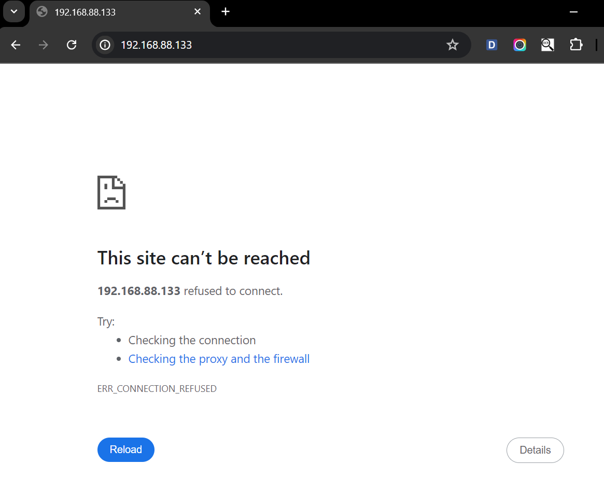

# Hướng dẫn cài đặt GitLab local trên Ubuntu Server 20.04

## Mục lục

- [Hướng dẫn cài đặt GitLab local trên Ubuntu Server 20.04](#hướng-dẫn-cài-đặt-gitlab-local-trên-ubuntu-server-2004)
  - [Mục lục](#mục-lục)
  - [1. Đăng nhập tài khoản root](#1-đăng-nhập-tài-khoản-root)
  - [2. Cài đặt các gói phụ thuộc](#2-cài-đặt-các-gói-phụ-thuộc)
  - [3. Cài đặt GitLab](#3-cài-đặt-gitlab)
  - [4. Cấu hình firewall](#4-cấu-hình-firewall)
  - [5. Khởi động GitLab](#5-khởi-động-gitlab)
  - [6. Tùy chỉnh file cấu hình GitLab (Tùy chọn)](#6-tùy-chỉnh-file-cấu-hình-gitlab-tùy-chọn)
  - [7. Khắc phục sự cố](#7-khắc-phục-sự-cố)
    - [Sự cố khi run `sudo apt-get update`](#sự-cố-khi-run-sudo-apt-get-update)
    - [7.2. Sự cố khi chạy ứng dụng](#72-sự-cố-khi-chạy-ứng-dụng)

## 1. Đăng nhập tài khoản root

```sh
su
```

## 2. Cài đặt các gói phụ thuộc

Cập nhật `apt` từ repository mặc định của `Ubuntu`

```sh
sudo apt-get update
```

Cài đặt các gói phụ thuộc:

```sh
sudo apt-get install -y curl ca-certificates openssh-server postfix tzdata perl runit libarchive-dev
```

## 3. Cài đặt GitLab

Chuyển đến thư mục `/tmp` và tải xuống `script` cài đặt `GitLab`:

```sh
cd /tmp
curl -O https://packages.gitlab.com/install/repositories/gitlab/gitlab-ee/script.deb.sh
```

Kiểm tra `script` nếu cần:

```sh
nano script.deb.sh
```

Chạy `script` cài đặt:

```sh
sudo bash /tmp/script.deb.sh
```

Script sẽ thiết lập máy chủ sử dụng `repository GitLab`. Và bây giờ bạn có thể cài đặt `Gitlab` bằng `apt`.

```sh
sudo apt-get update
```

Cài đặt GitLab với URL:

```sh
# specify the URL you configure GitLab instance for [EXTERNAL_URL=**]

# if specify the URL with https, installer tries to get certificate of the hostname specified at [EXTERNAL_URL=**] from Let's Encrypt,

# so it needs the host specified at [EXTERNAL_URL] can receive requests to 80 port from internet side

# (if not accessible, installation will be error state)
EXTERNAL_URL="http://your-domain_or_IP" apt-get install gitlab-ee
```



Pin phiên bản để giới hạn tự động cập nhật:

```sh
sudo apt-mark hold gitlab-ee
```

**Xác nhận mật khẩu ban đầu**

```sh
sudo cat /etc/gitlab/initial_root_password
```



Ghi lại mật khẩu hiển thị.

**Mật khẩu build mặc định ban đầu thường là**: fZBCrhyHGrd75m9U0WOXii7Xid0tlMQv7m4zFg4jDhk=

## 4. Cấu hình firewall

Kiểm tra trạng thái firewall:

```sh
sudo ufw status
```

Kích hoạt giao thức `HTTP` và `HTTPS` để ánh xạ cổng trong tệp `/etc/services`.

```sh
sudo ufw allow http
sudo ufw allow https
sudo ufw allow ssh
sudo ufw allow OpenSSH
```

Kiểm tra lại trạng thái firewall:

```sh
sudo ufw status
```

Kết quả dự kiến:

```sh
Status: active

To                         Action      From
--                         ------      ----
22/tcp                     ALLOW       Anywhere
80/tcp                     ALLOW       Anywhere
443/tcp                    ALLOW       Anywhere
OpenSSH                    ALLOW       Anywhere
22/tcp (v6)                ALLOW       Anywhere (v6)
80/tcp (v6)                ALLOW       Anywhere (v6)
443/tcp (v6)               ALLOW       Anywhere (v6)
OpenSSH (v6)               ALLOW       Anywhere (v6)
```

## 5. Khởi động GitLab

Mở trình duyệt và truy cập: `http://your-domain_or_IP`

## 6. Tùy chỉnh file cấu hình GitLab (Tùy chọn)

Nếu cần tùy chỉnh, chỉnh sửa file `gitlab.rb` và chạy lệnh cấu hình lại:

```sh
sudo nano /etc/gitlab/gitlab.rb
```

Tìm dòng `external_url` và chỉnh sửa theo domain hoặc IP của bạn:

```.rb
external_url 'http://xx.xx.xx.xx'
```

Lưu file và chạy lệnh cấu hình lại:

```sh
sudo gitlab-ctl reconfigure
```

## 7. Khắc phục sự cố

### Sự cố khi run `sudo apt-get update`

Nếu gặp lỗi như sau:

```sh
E: Release file for http://vn.archive.ubuntu.com/ubuntu/dists/focal-updates/InRelease is not valid yet (invalid for another 4d 5h 2min 13s). Updates for this repository will not be applied.
E: Release file for http://vn.archive.ubuntu.com/ubuntu/dists/focal-security/InRelease is not valid yet (invalid for another 2d 0h 18min 59s). Updates for this repository will not be applied.
E: Release file for https://packages.gitlab.com/gitlab/gitlab-ee/ubuntu/dists/focal/InRelease is not valid yet (invalid for another 2d 6h 39min 2s). Updates for this repository will not be applied.
```

Lỗi này do thời gian hệ thống không chính xác. Cài đặt lại thời gian đúng:

```sh
sudo apt-get install -y ntp
```

Sau đó cập nhật lại:

```sh
sudo apt-get update
```

### 7.2. Sự cố khi chạy ứng dụng

Nếu gặp lỗi "This site can’t be reached" và kiểm tra trạng thái GitLab như sau:



```sh
sudo gitlab-ctl status
```

Kết quả:

```sh
fail: alertmanager: runsv not running
fail: gitaly: runsv not running
fail: gitlab-exporter: runsv not running
fail: gitlab-kas: runsv not running
fail: gitlab-workhorse: runsv not running
fail: logrotate: runsv not running
fail: nginx: runsv not running
fail: node-exporter: runsv not running
fail: postgres-exporter: runsv not running
fail: postgresql: runsv not running
fail: prometheus: runsv not running
fail: puma: runsv not running
fail: redis: runsv not running
fail: redis-exporter: runsv not running
fail: sidekiq: runsv not running
```

Lỗi này do dịch vụ runsv không chạy. Thực hiện các bước sau để khắc phục:

**1. Đảm bảo `runit` được cài đặt và chạy:**

```sh
sudo apt-get install -y runit
```

**2. Khởi động thủ công `runsvdir`:**

```sh
sudo /opt/gitlab/embedded/bin/runsvdir-start &
```

**3. Khởi động lại các dịch vụ GitLab:**

```sh
sudo gitlab-ctl restart
```

**4. Kiểm tra trạng thái các dịch vụ:**

```sh
sudo gitlab-ctl status
```

Kết quả dự kiến:

```sh
run: alertmanager: (pid 1398) 1021s; run: log: (pid 1386) 1021s
run: gitaly: (pid 1395) 1021s; run: log: (pid 1380) 1021s
run: gitlab-exporter: (pid 1405) 1021s; run: log: (pid 1403) 1021s
run: gitlab-kas: (pid 1384) 1021s; run: log: (pid 1366) 1021s
run: gitlab-workhorse: (pid 1392) 1021s; run: log: (pid 1375) 1021s
run: logrotate: (pid 1396) 1021s; run: log: (pid 1389) 1021s
run: nginx: (pid 1373) 1021s; run: log: (pid 1367) 1021s
run: node-exporter: (pid 1383) 1021s; run: log: (pid 1365) 1021s
run: postgres-exporter: (pid 1391) 1021s; run: log: (pid 1369) 1021s
run: postgresql: (pid 1378) 1021s; run: log: (pid 1374) 1021s
run: prometheus: (pid 1387) 1021s; run: log: (pid 1370) 1021s
run: puma: (pid 1385) 1021s; run: log: (pid 1379) 1021s
run: redis: (pid 1372) 1021s; run: log: (pid 1364) 1021s
run: redis-exporter: (pid 1397) 1021s; run: log: (pid 1376) 1021s
run: sidekiq: (pid 1390) 1021s; run: log: (pid 1382) 1021s
```

**5. Cấu hình lại GitLab:**

```sh
sudo gitlab-ctl reconfigure
```

**6. Khởi động lại hệ thống:**

Khởi động lại máy chủ để đảm bảo tất cả các thay đổi có hiệu lực và các dịch vụ khởi động chính xác:

```sh
sudo reboot
```

**7. Kiểm tra logs để biết thêm thông tin chi tiết:**

```sh
sudo gitlab-ctl tail
```

Nếu dịch vụ nào vẫn không khởi động, thử khởi động thủ công:

```sh
sudo gitlab-ctl start postgresql
sudo gitlab-ctl start nginx
sudo gitlab-ctl start redis
```

Nếu sự cố vẫn tiếp diễn, hãy kiểm tra nhật ký chi tiết để biết thêm thông tin:

```sh
sudo gitlab-ctl tail
```

---

Hướng dẫn này cung cấp các bước chi tiết để cài đặt và cấu hình GitLab trên Ubuntu Server 20.04, cũng như các bước khắc phục sự cố thường gặp. Nếu bạn gặp vấn đề nào không thể giải quyết, hãy kiểm tra kỹ lại các bước hoặc tìm kiếm sự trợ giúp từ cộng đồng GitLab.

Chúc các bạn cài đặt git thành công.
